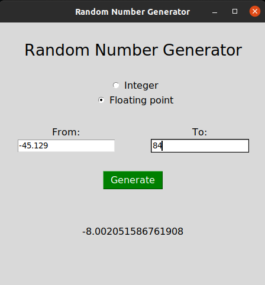
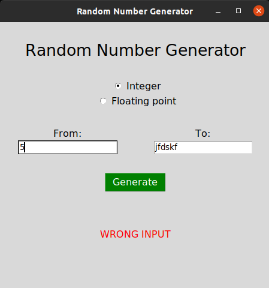

# RandomNumberGenerator
A simple desktop application to generate random numbers.

# Tools:
Python 3.8.5, module Tkinter

# How it looks like:

# License
The code is available under the [MIT](LICENSE) license.
